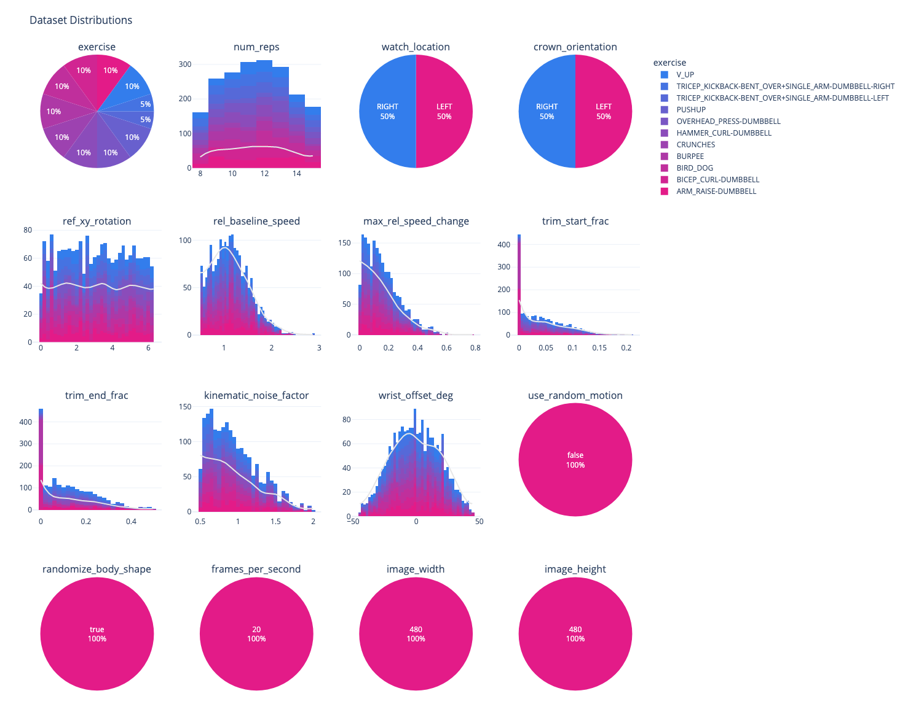

  

# IMU Fitness Basic Dataset
An open-source synthetic dataset for wearable fitness applications.

  

## Overview 
The IMU Fitness Basic Dataset contains 2,000 paired video and IMU (angular position) samples of avatars doing multiple reps of 10 common exercises. The dataset includes massive variation in movement trajectories, rep cadence, body shapes, and more. Avatars perform each rep slightly differently, just like real humans!

Samples in the IMU Fitness Basic Dataset are accompanied by perfect labels and annotations, designed to accelerate your models and give them the information they need.

## Dataset Features

- 2,000 paired video + IMU (angular position) time series.
- 10 exercises.
- Life-like rep behavior (no two reps are the same).
- Widespread variation in kinematic trajectories, range of motion, and rep speed.
- Avatars with diverse heights and body shapes.

  

## Exercises

The dataset includes the following exercises. Visuals of each are provided in the header image above.

1. Arm Raises
2. Bicep Curls
3. Bird Dogs
4. Burpees
5. Crunches
6. Hammer Curls
7. Overhead Press
8. Pushups
9. Bent-over Tricep Kickbacks
10. V-Ups

## Getting Started

Download the dataset from the [Infinity Marketplace](https://marketplace.infinity.ai/products/imu-fitness-basic-dataset), and use the provided [quickstart notebook](quickstart.ipynb) to visualize labels and filter the dataset based on provided metadata.

## Contents and Annotations

  

For each dataset sample, we provide the following files:

- `{video_number}_params.json`: A JSON file describing the parameters used to generate the dataset sample. See [below](#dataset-parameters) for a description of each.
- `{video_number}.csv`: A CSV file containing the simulated angular position data and ground truth rep count labels.
  - We provide angular position measurements in the form of rotation matrices. More specifically, we provide rotation matrices that measure the relative difference between the simulated device orientation and an arbitrary reference orientation that has its Z-axis in the vertical direction. Angular position data has been validated against the CMAttitude measurements provided by the [Apple CoreMotion SDK](https://developer.apple.com/documentation/coremotion/cmattitude) used on the Apple Watch.
  - The angular position data is provided in the form of 3D rotation matrices. Column headers for the rotation matrix data are formatted as `rotation_matrix_m{row}{column}`. Rotation matrices can easily be converted to eulers and quaternions, which we demonstrate in our [quickstart notebook](quickstart.ipynb). Refer to this [wikipedia article](https://en.wikipedia.org/wiki/Rotation_matrix) for more information.
  - Two versions of rep count labels are provided. `rep_count_from_start` is indexed to the start of the recording. It considers the pose visualized in the first frame of the video to be the starting (and ending) position of a rep. `rep_count_from_intermediate` is instead indexed to the intermediate (i.e. semantic midpoint) pose of the rep sequence. For example, if `rep_count_from_start` is indexed to the point of most extension, then `rep_count_from_intermediate` is indexed to the point of most flexion. We provide both since users may wish to define the point of most flexion OR the point of most extension as the rep inflection point.

- `{video_number}.mp4`: A video of the animated armature and body mesh corresponding to the simulated IMU data. The 3-axis coordinate system visualized on the wrist represents the simulated orientation of the device. The other (non-moving) 3-axis coordinate system that is visualized represents the reference orientation. The data provided in the CSV is the relative difference between these two orientations.

  

## Dataset Parameters

The `{video_number}_params.json` file provided for each dataset sample includes the parameters that were used to generate that specific sample. For convenience, we provide a description of each parameter below:

- `num_reps`: Number of exercise repetitions in the returned time series data.
- `watch_location`: Wrist where device is placed (left or right).
- `crown_orientation`: Which side the watch crown points (from first-person perspective; left or right).
- `ref_xy_rotation`: Rotation (in XY plane) of the reference orientation in radians (simulates the xArbitraryZVertical reference in the Apple CoreMotion SDK).
- `rel_baseline_speed`: Baseline speed of animation, relative to default (natural) speed.
- `max_rel_speed_change`: Maximum speed change introduced, relative to baseline speed.
- `trim_start_frac`: Fraction of seed animation (from start to midpoint) to truncate at the start.
- `trim_end_frac`: Fraction of seed animation (from start to midpoint) to truncate at the end.
- `kinematic_noise_factor`: Scaling factor used to adjust the amount of kinematic noise added in the simulated movement.
- `wrist_offset_deg`: Fixed rotation offset applied to the supination/pronation axis of the wrists, in degrees. Negative values correspond to supination.
- `randomize_body_shape`: If True, the avatar's body shape is randomized.
- `frames_per_second`: Sampling rate of exported time series and video.
- `image_width`: Width dimension of the rendered video, in pixels.
- `image_height`: Height dimension of the rendered video, in pixels.

## Terms and Conditions
This work is licensed under a
[Creative Commons Attribution 4.0 International License](http://creativecommons.org/licenses/by/4.0/). Both academic and commercial applications are allowed.