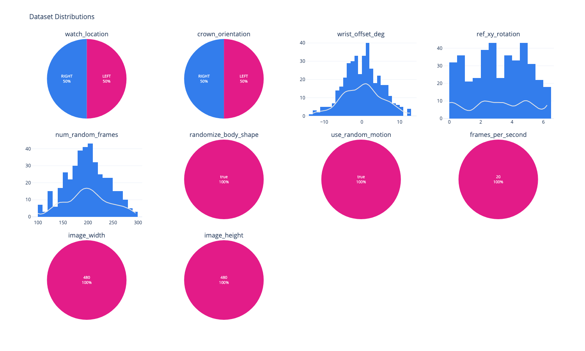
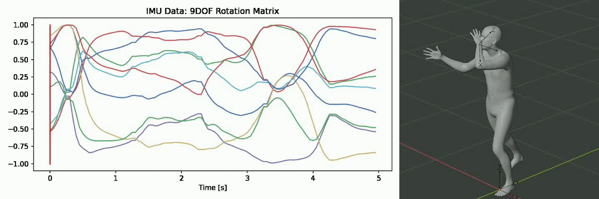

  

# IMU Random Motion Dataset
An open-source synthetic IMU dataset of random movements to make models robust to non-target movements.

  

The IMU Random Motion Dataset contains 400 random motion examples with paired video and IMU (angular position) recordings. The movement is designed to be temporally and spatially coherent, and is bound by physical constraints such as natural arm flexion and extension. This dataset pairs well with the [IMU Fitness Basic Dataset](../imu-fitness-basic), and can be used to help models distinguish between a specific action and random movements.

## Dataset Features

- 400 paired IMU (angular position) samples + videos.
- Biomechanically-constrained, temporally and spatially coherent random movements.
- Serves as negative data for ML models (e.g. rep counting).
- 20 Hz recordings.
- Variation in IMU sensor locations (left and right wrists) and crown orientations (proximal and distal). 

  

## Getting Started

Download the dataset from the [Infinity Marketplace](https://marketplace.infinity.ai/products/imu-fitness-random-motion-dataset), and use the provided [quickstart notebook](quickstart.ipynb) to visualize labels and filter the dataset based on provided metadata.

## Contents

  

For each dataset sample, we provide the following files:

- `{video_number}_params.json`: A JSON file describing the parameters used to generate the dataset sample. See [below](#dataset-parameters) for a description of each.
- `{video_number}.csv`: A CSV file containing the simulated angular position data.
  - We provide angular position measurements in the form of rotation matrices. More specifically, we provide rotation matrices that measure the relative difference between the simulated device orientation and an arbitrary reference orientation that has its Z-axis in the vertical direction. Angular position data has been validated against the CMAttitude measurements provided by the [Apple CoreMotion SDK](https://developer.apple.com/documentation/coremotion/cmattitude) used on the Apple Watch.
  - The angular position data is provided in the form of 3D rotation matrices. Column headers for the rotation matrix data are formatted as `rotation_matrix_m{row}{column}`. Rotation matrices can easily be converted to eulers and quaternions, which we demonstrate in our [quickstart notebook](quickstart.ipynb). Refer to this [wikipedia article](https://en.wikipedia.org/wiki/Rotation_matrix) for more information.

- `{video_number}.mp4`: A video of the animated armature and body mesh corresponding to the simulated IMU data. The 3-axis coordinate system visualized on the wrist represents the simulated orientation of the device. The other (non-moving) 3-axis coordinate system that is visualized represents the reference orientation. The data provided in the CSV is the relative difference between these two orientations.

## Dataset Parameters
The `{video_number}_params.json` file provided for each dataset sample includes the parameters that were used to generate that specific sample. For convenience, we provide a description of each parameter below:

- `watch_location`: Wrist where device is placed (left or right).
- `crown_orientation`: Which side the watch crown points (from first-person perspective; left or right).
- `ref_xy_rotation`: Rotation (in XY plane) of the reference orientation in radians (simulates the xArbitraryZVertical reference in the Apple CoreMotion SDK).
- `wrist_offset_deg`: Fixed rotation offset applied to the supination/pronation axis of the wrists, in degrees. Negative values correspond to supination.
- `randomize_body_shape`: If True, the avatar's body shape is randomized.
- `frames_per_second`: Sampling rate of the exported time series and video.
- `image_width`: Width dimension of the rendered video, in pixels.
- `image_height`:  Height dimension of the rendered video, in pixels.

## Terms and Conditions
This work is licensed under a
[Creative Commons Attribution 4.0 International License](http://creativecommons.org/licenses/by/4.0/). Both academic and commercial applications are allowed.